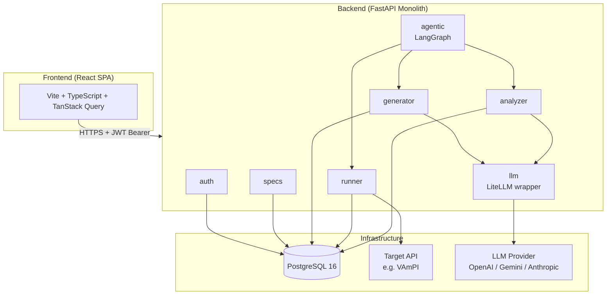
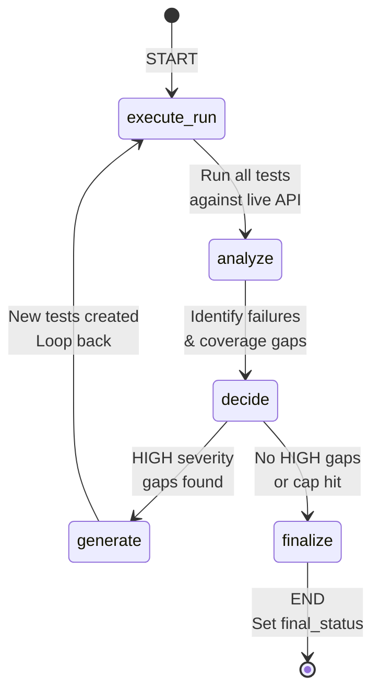
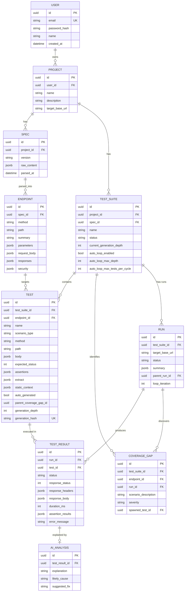
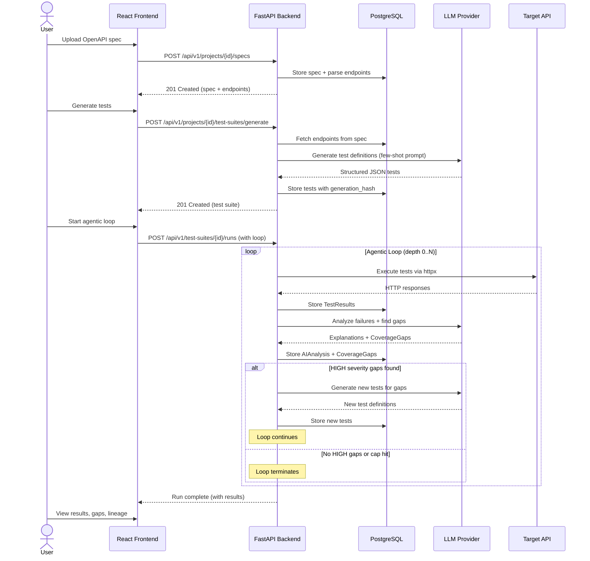

# Architecture Document

> AI-Assisted API Test Generation Platform — Architecture Overview

---

## 1. Overview

This platform is an AI-assisted API test generation system that automatically creates, executes, and iteratively improves API test suites. The core innovation is an **agentic loop** — a LangGraph-orchestrated cycle that executes tests, analyzes results for coverage gaps, and generates new tests to fill those gaps.

The system targets OpenAPI-defined APIs and produces structured JSON test cases covering positive, negative, and security scenarios (BOLA/IDOR, authentication bypass, injection attacks).

### Key Capabilities
- **OpenAPI ingestion:** Upload and parse OpenAPI 2.0/3.x specs to extract endpoints, parameters, and security schemes.
- **AI-powered generation:** LLM-driven test creation using few-shot prompting with structured JSON output.
- **Automated execution:** HTTP-based test runner with assertion evaluation against live target APIs.
- **Coverage analysis:** AI-powered gap detection identifying missing security scenarios per endpoint.
- **Agentic iteration:** Autonomous loop that generates new tests for discovered gaps until coverage is satisfactory or safety caps are hit.

---

## 2. Architecture Pattern: Modular Monolith

The system follows a **modular monolith** pattern (see [ADR-001](adr/001-modular-monolith.md)). A single FastAPI backend serves all domain functionality, organized into isolated modules with clear boundaries.



### Module Responsibilities

| Module | Directory | Responsibility |
|---|---|---|
| **auth** | `app/auth/` | User registration, login, JWT token issuance and validation |
| **specs** | `app/specs/` | Project CRUD, OpenAPI spec upload/parsing, endpoint extraction |
| **generator** | `app/generator/` | Test suite creation, LLM-driven test generation, deduplication |
| **runner** | `app/runner/` | Test execution via `httpx`, assertion evaluation, result recording |
| **analyzer** | `app/analyzer/` | Failure explanation, coverage gap detection via LLM |
| **agentic** | `app/agentic/` | LangGraph state machine orchestrating the execute→analyze→generate loop |
| **llm** | `app/llm/` | LiteLLM abstraction for provider-agnostic LLM calls |

---

## 3. Agentic Loop — The Core Innovation

The agentic loop is the platform's differentiator. Unlike one-shot test generators, this system **iteratively improves** test coverage through an autonomous feedback loop.

### LangGraph State Machine



### State Definition

The `AgenticLoopState` TypedDict carries context through each iteration:

```
AgenticLoopState:
  test_suite_id     — UUID of the test suite
  target_base_url   — Base URL of the target API
  current_depth     — Iteration counter (0-based)
  max_depth         — Hard cap (default: 3, max: 5)
  max_tests_per_cycle — Tests generated per iteration (default: 5, max: 10)
  last_run_id       — UUID of the most recent execution run
  last_gaps         — Coverage gaps from latest analysis
  new_test_ids      — Tests generated in current iteration only
  total_tokens_used — Cumulative LLM token spend (reducer: operator.add)
  final_status      — Terminal state reason
```

### Safety Caps
- **Max 5 iterations** — Prevents runaway loops.
- **Max 10 tests per cycle** — Bounds generation cost.
- **200K token budget** — Hard cap on cumulative LLM spend.

### Loop Behavior
1. **Depth 0:** Execute all tests in the suite (baseline).
2. **Depth > 0:** Execute only `new_test_ids` (tests generated in the previous iteration) to avoid redundant re-execution.
3. **Termination:** The loop ends when no HIGH-severity gaps remain, max depth is reached, or the token budget is exhausted.

---

## 4. Data Model



### Key Relationships
- **Test lineage:** `Test.parent_coverage_gap_id` → `CoverageGap.id` → `CoverageGap.spawned_test_id` creates a bidirectional link showing which gap triggered which test.
- **Run chaining:** `Run.parent_run_id` links iterations of the agentic loop, enabling lineage tree visualization.
- **Deduplication:** `Test.generation_hash` (unique per suite) prevents the LLM from generating duplicate tests across iterations.

---

## 5. Communication Flow



---

## 6. Technology Stack

| Layer | Technology | Purpose |
|---|---|---|
| **Frontend** | React 18, Vite, TypeScript | Single-page application |
| | TanStack Query v5 | Server state management & caching |
| | React Router v6 | Client-side routing |
| | shadcn/ui + Tailwind CSS | Component library & styling |
| | React Flow | Lineage tree visualization |
| **Backend** | FastAPI | Async web framework |
| | SQLAlchemy 2.0 (async) | ORM with asyncpg driver |
| | Pydantic v2 | Request/response validation |
| | Alembic | Database migrations |
| | Uvicorn | ASGI server |
| | httpx | Async HTTP client for test execution |
| **AI Layer** | LiteLLM | Provider-agnostic LLM abstraction |
| | LangGraph | Agentic loop state machine |
| | langgraph-checkpoint-postgres | Crash-recovery checkpointing |
| | psycopg3 | Checkpointer DB driver (separate from asyncpg) |
| **Infrastructure** | PostgreSQL 16 | Primary database (JSONB for structured test data) |
| | Docker Compose | Local development orchestration |
| | VAmPI | Intentionally vulnerable API for demo/testing |

---

## 7. Security Considerations

- **Authentication:** JWT-based with bcrypt password hashing (see [ADR-006](adr/006-jwt-auth-poc-scope.md)).
- **Authorization:** All data endpoints enforce ownership checks via `CurrentUser` dependency — users can only access their own projects, specs, and test results.
- **No arbitrary code execution:** Tests are structured JSON data interpreted by a deterministic runner, not executable code (see [ADR-003](adr/003-data-driven-tests.md)).
- **Target API isolation:** The runner executes HTTP requests against a user-specified `target_base_url`. In production, this should be validated and potentially sandboxed.

---

## 8. Deployment Architecture

### Local Development
```
docker-compose up -d          # PostgreSQL + VAmPI
uvicorn app.main:app --reload # Backend on :8000
npm run dev                   # Frontend on :5173
```

### Production (Planned)
- **Backend:** Docker container running Uvicorn behind a reverse proxy.
- **Frontend:** Static build served via Nginx or cloud CDN.
- **Database:** Managed PostgreSQL (e.g., Render PostgreSQL, Neon, Supabase).
- **Target API:** VAmPI deployed as a separate service for demo purposes.

---

## 9. Architecture Decision Records

| ADR | Title | Status |
|---|---|---|
| [001](adr/001-modular-monolith.md) | Modular Monolith Architecture | Accepted |
| [002](adr/002-no-rag-few-shot-instead.md) | Few-Shot Prompting Over RAG | Accepted |
| [003](adr/003-data-driven-tests.md) | Data-Driven Tests via Structured JSON | Accepted |
| [004](adr/004-langgraph-for-agentic-loop.md) | LangGraph for Agentic Loop | Accepted |
| [005](adr/005-litellm-for-provider-portability.md) | LiteLLM for Provider Portability | Accepted |
| [006](adr/006-jwt-auth-poc-scope.md) | JWT Auth Scoped to POC | Accepted |
